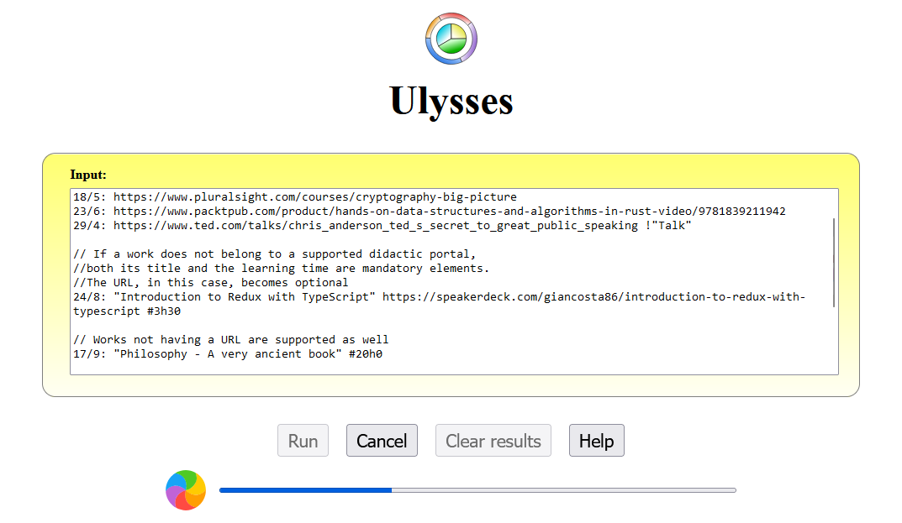

# Ulysses

_Simplified generation of OmniCourse descriptors_



**Ulysses** is a web application - packaged as a standalone CLI script - dedicated to the simplified generation of [OmniCourse](https://github.com/giancosta86/OmniCourse) _work descriptors_.

More precisely, the user can input lines using _a compact format_ - **one line per work** - and the app will try to fetch the missing information from the supported official websites.

> Ulysses becomes essential as one completes more and more courses and books while keeping track of them with OmniCourse.

## Installation

To install Ulysses:

```bash
npm install --global @giancosta86/ulysses
```

Then, to start the app:

```bash
ulysses [<port>]
```

where:

- **port** is optional and defaults to **2000**

To stop the app, press **CTRL+C** in the terminal.

## Input format

Ulysses reads a minimalist log of **works**: each non-empty line must adhere to a specific format and will be converted to an OmniCourse _work descriptor_ in **JSON format**; _empty lines and spaces between line components are ignored_, as well as lines starting with **//**.

This is the expected line format:

> **\<completion date>**: [**"\<title between double quotes>"**] [**\<url not between double quotes>**] **\#\<learning time>**

where:

- **completion date** is _mandatory_ and can be written as:

  - **\<day>/\<month>**, assuming the year is the current one

  - **\<day>/\<month>/\<year>**, which is the most complete format

  - **\*** - meaning that the work has _no completion date_ yet - because it's _in progress_

- **title** is _optional_ but, if present, _must_ be enclosed in double quotes

- **url** is _optional_ but recommended: if the URL belongs to a supported didactic provider, it is used to fetch missing information such as the title and the learning time. It must _not_ be enclosed in quotes

- **learning time** is optional but, if declared, must be prefixed by a **\#** symbol. Its overall format is:

  > \#\<hours>h\<minutes>

  where **hours** and **minutes** are **mandatory**, arbitrary numbers (even 0), separated by the letter **h**

What matters is that - with or without the aid of the URL - the line enables Ulysses to gather enough information to create an OmniCourse work descriptor - that is, the **title** and the **learning time in minutes**, with the additional constraint of the **completion date**.

### Examples

To see Ulysses in action, you could input the following text, then click **Run**:

```
// Ulysses supports a variety of didactic portals: in this case, the title and the learning time of each course are automatically fetched from its page
29/4: https://www.ted.com/talks/chris_anderson_ted_s_secret_to_great_public_speaking
18/5: https://www.pluralsight.com/courses/cryptography-big-picture
23/6: https://www.packtpub.com/product/introduction-to-unity-video/9781789807653

// If a work does not belong to a supported didactic portal, both its title and the learning time are mandatory elements; the URL, in this case, becomes optional
24/8: "Introduction to Redux with TypeScript" https://speakerdeck.com/giancosta86/introduction-to-redux-with-typescript #3h30

// Works not having a URL are supported as well
17/9: "Philosophy - A very ancient book" #20h0

// There are also hybrid cases: for example, the URL of a book published onto a didactic portal enables the app to fetch its title, but the learning time remains a mandatory element
21/10: https://www.packtpub.com/product/c-9-and-net-5-modern-cross-platform-development-fifth-edition/9781800568105 #11h30
```

## Third-party images

- [Rainbow loader](https://icons8.com/preloaders/en/circular/rainbow/) from [Preloaders.net](https://icons8.com/preloaders/)
